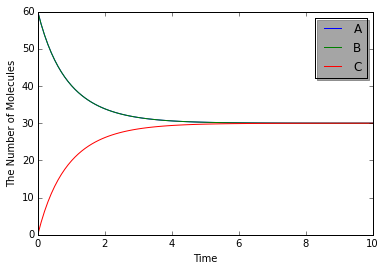

# Tutorials

The Tutorial is divided in three sections: Basic, Topical and Advanced exercises. We recommend to try all Basic exercises to understand how to use E-Cell4. Each section contains several IPython notebooks with different exercises. 

Get started with E-Cell4 by going through the tutorial.

## Basic Exercises

There are three important components to understand E-Cell4: `Model`, `World` and `Simulator` classes. These components describe different concepts in a simulation.

`Model`, as its name suggests, describes the matter to simulate.  
`World` describes the state. For example, initial state or a state of a time-point.  
`Simulator` describes the solver and algorithm.

These three components are independent, but `World` is often dependent on a type of `Simulator`.

- [Model](http://nbviewer.ipython.org/github/ecell/ecell4/blob/develop/ipynb/Tutorials/ModelBasics.ipynb)
- [World](http://nbviewer.ipython.org/github/ecell/ecell4/blob/develop/ipynb/Tutorials/WorldBasics.ipynb)
- [Simulator](http://nbviewer.ipython.org/github/ecell/ecell4/blob/develop/ipynb/Tutorials/Simulator.ipynb)

## Topical Exercises

- [Visualizer](http://nbviewer.ipython.org/github/ecell/ecell4/blob/develop/ipynb/Tutorials/Visualizer.ipynb)
- [Rule-based Modeling](http://nbviewer.ipython.org/github/ecell/ecell4/blob/develop/ipynb/Tutorials/RuleBasedModeling.ipynb)
- [Observer](http://nbviewer.ipython.org/github/ecell/ecell4/blob/develop/ipynb/Tutorials/Observer.ipynb)

## Advanced Exercises

- [World Advanced](http://nbviewer.ipython.org/github/ecell/ecell4/blob/develop/ipynb/Tutorials/WorldAdvanced.ipynb)
- [Model Advanced](http://nbviewer.ipython.org/github/ecell/ecell4/blob/develop/ipynb/Tutorials/ModelAdvanced.ipynb)
- [Simple equilibrium model](http://nbviewer.ipython.org/github/ecell/ecell4/blob/develop/ipynb/Tutorials/SimpleEquilibrium.ipynb)

## Example

Here is an extremely simple example with a reversible binding reaction:

    %matplotlib inline
    import numpy
    from ecell4 import *
    
    with reaction_rules():
        A + B == C | (0.01, 0.3)
    
    y = run_simulation(
        numpy.linspace(0, 10, 100), {'A': 60, 'B': 60}, solver='ode')

More examples are available below:

- [MSD](http://nbviewer.ipython.org/github/ecell/ecell4/blob/develop/ipynb/Examples/MSD.ipynb) explains how to take statistics of trajectories of particles freely diffusing in three-dimensional space. This would be the best demonstration to explain the usage of `FixedIntervalTrajectoryObserver`.

